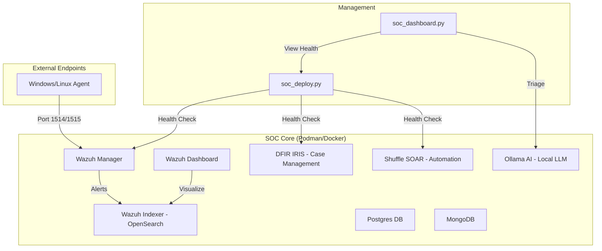

# 🛡️ AI-Powered SOC Lab (Stand-alone Edition)

A fully containerized, automated SOC (Security Operations Center) laboratory environment featuring Wazuh, DFIR IRIS, Shuffle SOAR, and Ollama AI. This environment is designed for rapid deployment, threat hunting, and automated incident response using local AI.

## 🏗️ Architecture



## 🚀 Features
*   **Wazuh 4.7.0**: Enterprise-grade SIEM and XDR.
*   **DFIR IRIS**: Advanced case management for security teams.
*   **Shuffle SOAR**: No-code automation for security workflows.
*   **Ollama AI**: Local AI analyst for automated alert triaging.
*   **One-Click Deployment**: Entire stack boots in < 5 minutes with a single command.
*   **Auto-Configuration**: Automatic SSL bypass and credential synchronization.

## 📋 Prerequisites
*   **Podman** (or Docker) with `podman-compose`.
*   **Python 3.9+**.
*   **Resources**: 8GB+ RAM recommended (16GB for best performance with Ollama).

## 🛠️ Quick Start

### 1. Install Dependencies
```bash
pip install -r requirements.txt
```

### 2. Deploy the Stack
```bash
python main.py deploy
```

### 3. Access the Dashboard
```bash
streamlit run soc_dashboard.py
```

## 🔐 Credentials Guide

All credentials are automatically generated and stored in a `.env` file during deployment.

| Service | URL | Default User |
| :--- | :--- | :--- |
| **Wazuh/OpenSearch** | [https://localhost:443](https://localhost:443) | `admin` |
| **DFIR IRIS** | [http://localhost:8000](http://localhost:8000) | `administrator` |
| **Shuffle SOAR** | [http://localhost:3443](http://localhost:3443) | *Created on first run* |
| **Ollama** | [http://localhost:11434](http://localhost:11434) | N/A |

> **Security Note:** Check the `.env` file or container logs for the randomly generated passwords.

## 📡 Adding Endpoints
To add your host machine or a VM:
1.  Install the **Wazuh Agent**.
2.  Point it to the Manager IP: `127.0.0.1` (if running locally).
3.  Ensure ports `1514` and `1515` are open in your firewall.

## 📡 Distributed Setup (LAN Agents)
If you want to connect agents from other machines on your network:
1. **On Host**: Run `python main.py deploy` or `reset`.
2. **Open Firewall**: Run `New-NetFirewallRule -DisplayName "Wazuh Agent" -Direction Inbound -LocalPort 1514,1515 -Protocol TCP -Action Allow` (Admin PowerShell).
3. **Port Bridge (Windows Host)**: If Podman binds to 127.0.0.1, run:
   `netsh interface portproxy add v4tov4 listenport=1515 listenaddress=<YOUR_IP> connectport=1515 connectaddress=127.0.0.1`
4. **Register Agent**: Point your external agent to `<YOUR_HOST_IP>`.

## 🧪 Testing the Stack
To verify everything is working, run this on an agent:
```powershell
"X5O!P%@AP[4\PZX54(P^)7CC)7}$EICAR-STANDARD-ANTIVIRUS-TEST-FILE!$H+H*" | Out-File -FilePath C:\Users\Public\test_alert.txt
```
Check the **Wazuh Dashboard** and **AI Triage** tab for results!

## 🧹 Maintenance
*   **Check Health:** `python main.py health`
*   **Stop Stack:** `python main.py destroy`
*   **Reset Environment:** `python main.py reset` (Wipes all data and starts fresh)

---
*Created with Antigravity*
